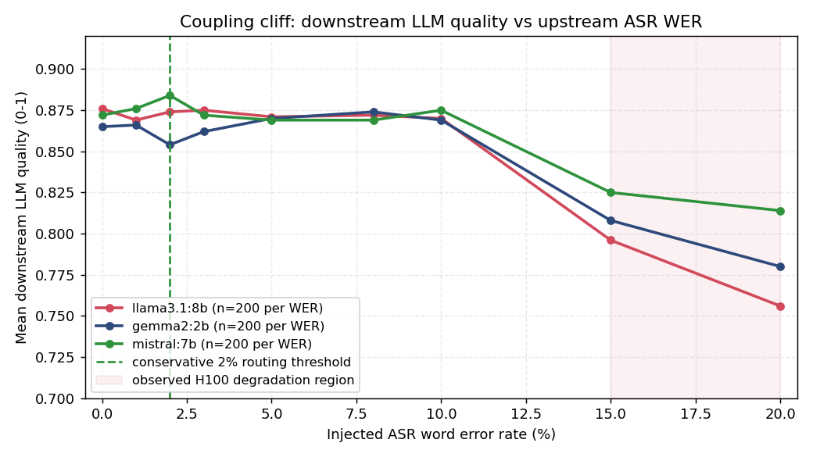

# PAVO: Pipeline-Aware Voice Orchestration

**Demand-conditioned inference routing for real-time ASR → LLM → TTS voice pipelines.**

[](LICENSE)
[](DATA_LICENSE.md)
[](#citation)
[](docs/RELEASE_NOTES_v1.0.1.md)
[](https://huggingface.co/datasets/vnmoorthy/pavo-bench)
[](https://www.python.org/downloads/)
[](https://github.com/vnmoorthy/pavo-bench/actions/workflows/validate.yml)
[](https://colab.research.google.com/github/vnmoorthy/pavo-bench/blob/main/notebooks/quickstart.ipynb)

PAVO treats the voice-assistant pipeline as a jointly optimizable inference graph. An **85,041-parameter** meta-controller, trained with multi-objective PPO in **106 seconds on an H100**, decides per turn whether to route each ASR → LLM → TTS call to a cloud or edge configuration. The empirical contribution is a characterization of **inter-stage coupling constraints** — quality dependencies where upstream ASR choices bound what downstream LLMs can recover from.

**Authors:** NarasingaMoorthy VeiluKanthaPerumal (University of Pennsylvania) and Mohammed Imthathullah (Google).

**Status:** Accepted at Transactions on Machine Learning Research (TMLR), 2026.

**Artifact status:** Start with the [claim-to-artifact provenance map](docs/RESULT_PROVENANCE.md),
[controller specification](docs/CONTROLLER.md), and
[camera-ready vs historical file catalog](docs/ARTIFACT_STATUS.md). The
repository preserves earlier public artifacts for history; not every file in
the tree supports a camera-ready claim.

---

## Headline results

Direct experiments use NVIDIA H100 (Lambda Labs) and Apple M3 8 GB. The 50,000-turn routing evaluation is a simulation parameterized by those measurements and published benchmarks for unavailable A100/Jetson configurations.

| Metric | Reported result | Public evidence scope |
|---|---|---|
| P95 end-to-end latency (H100, LibriSpeech) | **−10.3%** (−167 ms) | Mixed measured/simulated summary in `tier2_e2e_results.json` |
| Median latency | **−34%** | Manuscript aggregate; standalone routing trace was not found |
| Energy per turn | **−71%** | Manuscript aggregate; standalone routing trace was not found |
| Coherence-failure rate | **7.1% → 0.9%** (7.9×), +110 ms median | Manuscript aggregate; raw annotation/routing trace was not found |
| Meta-controller size | 85,041 parameters | Verifiable from both safetensors files |
| Meta-controller training | 106 seconds | Metadata in the committed PPO training log |

The reported `p = 2×10⁻⁶` is from the paired test of **mean** end-to-end latency (2,277 vs 2,671 ms over five catalog-simulation replications), not the descriptive P95 comparison. The paired Wilcoxon test on the same five replications gives `p = 0.0625`.



The paper characterizes two coupling regimes: a **sharp factual-accuracy cliff** and **gradual semantic degradation**. In the H100 aggregate (`n=200` per WER level per model), all three LLM families remain stable through 10% injected WER and degrade at 15–20%. The preliminary M3 pilot uses the same 30 factual questions per condition and motivates a conservative 2% routing threshold; its WER labels are nominal because the recovered code enforces at least one corrupted token on short questions. The 2% threshold is not the measured H100 cliff location.

---

## Why this matters

Most voice-stack work optimizes ASR, LLM, and TTS independently. In practice, accuracy and latency of each stage interact: a noisy transcript pushes the LLM over a quality cliff, while an over-provisioned cloud route wastes energy on turns an edge model would have handled. PAVO provides:

1. **PAVO-Bench** — a 50K-turn voice interaction benchmark with complexity labels (40K train / 10K test), released on HuggingFace.
2. **Released controller weights** — an 85,041-parameter policy-plus-value model, with exact input, mask, analytic action, and PPO settings documented.
3. **Auditable coupling artifacts** — a three-model H100 aggregate reporting 5,400 calls plus a recovered 30-question M3 pilot, with limitations stated explicitly.

---

## Quickstart

### Python API (CPU, no ollama needed — ~30 s)

```bash
pip install git+https://github.com/vnmoorthy/pavo-bench.git
```

```python
from pavo_bench import (
    load_dataset, AlwaysCloudRouter, AlwaysEdgeRouter, HybridRouter,
    PretrainedPAVORouter, BaseRouter, benchmark_router,
)

turns = load_dataset(split="test")   # 10K test turns from Hugging Face
controller = PretrainedPAVORouter.from_released()  # downloads safetensors if needed
logits = controller.action_logits(turns[0])
print(logits.shape, int(logits.argmax()))  # torch.Size([48]), raw action index

for R in [AlwaysCloudRouter(), AlwaysEdgeRouter(), HybridRouter()]:
    r = benchmark_router(R, turns)
    print(f"{r.router:<18s} P95={r.latency_ms_p95:>7.0f} ms   "
          f"quality={r.quality_mean:.3f}   energy={r.energy_mj_mean:>6.1f} mJ")
```

This convenience simulator is for API smoke tests and within-simulator router
comparisons. It is **not** a checkpoint replay of the camera-ready result table:
the release has no concrete mapping from 48 action indices to deployable stage
tuples. The released wrapper therefore exposes raw logits and makes `route()`
fail clearly instead of silently fabricating a three-profile mapping. See
[`docs/CONTROLLER.md`](docs/CONTROLLER.md). Write your own router by subclassing
`BaseRouter`; the notebook provides a complete example.

### Environment-bound experiment reruns (GPU + Ollama)

```bash
git clone https://github.com/vnmoorthy/pavo-bench.git
cd pavo-bench
bash experiments/setup.sh                  # installs torch, whisper, ollama + pulls llama3.1:8b and gemma2:2b

# Run the retained development runner without uploading
python experiments/run_all_experiments.py --skip-upload

# Or run experiments individually
python experiments/exp1_e2e_pipeline.py          # End-to-end pipeline (Tier 2)
python experiments/exp2_coupling_calibration.py  # Historical two-model H100 calibration
python experiments/exp3_train_ppo.py             # PPO meta-controller training (~106 s on H100)
python experiments/exp4_real_ablation.py         # Historical heuristic-quality ablation
```

The PPO source and committed log report about two minutes on the original H100.
These environment-bound scripts can produce new measurements, but they are not
a one-command, byte-for-byte regeneration of every camera-ready aggregate.
Read `experiments/original_runs/README.md` and the provenance map before reruns.

---

## Repository layout

```
experiments/
  setup.sh                     Install deps, ollama, and pull models
  run_all_experiments.py       Master runner (cached HF login or hidden token prompt)
  exp1_e2e_pipeline.py         End-to-end pipeline (Whisper + LLM on LibriSpeech)
  exp2_coupling_calibration.py Historical two-model H100 calibration
  exp3_train_ppo.py            PPO meta-controller training (85K params, 106 s)
  exp4_fix.py                  Historical development utility
  exp4_real_ablation.py        Historical heuristic-quality ablation
  outputs/
    meta_controller.safetensors       Pickle-free inference-only trained weights
    meta_controller_best.safetensors  Pickle-free inference-only best checkpoint
    meta_controller.pt                Legacy PyTorch checkpoint
    meta_controller_best.pt           Legacy best checkpoint
    CHECKSUMS.txt                      SHA-256 checksums for all checkpoints
    training_log.json          PPO training log (100 K steps)
    coupling_results_200.json  Historical two-model output
    ablation_bertscore.json    Historical A100-era output
  outputs_new/                 Paper-aligned coupling/E2E/ablation summaries, including M3
  original_runs/               Quarantined original entry points for provenance
  scripts/supervised_baseline/ LR/RF/XGBoost/MLP-CE baselines vs PPO

tier1_statistical_results.json Statistical reproducibility (5 trials x 1,000 turns)
tier1_coupling_results.json    Historical n=10 pilot; not camera-ready evidence
tier1_llm_latency_results.json LLM latency profile (short/medium/long contexts)

tier2_e2e_results.json              End-to-end cloud_premium vs edge_fast (200 LibriSpeech)
tier2_cross_dataset_results.json    Cross-dataset ASR (LibriSpeech + FLEURS)
tier2_noise_robustness_results.json ASR robustness at SNR 5-30 dB

tier3_50k_train.jsonl          PAVO-Bench train split (40,000 turns)
tier3_50k_test.jsonl           PAVO-Bench test split (10,000 turns)
tier3_50k_summary.json         Split / complexity distribution / generation stats
tier3_scaling_results.json     Per-model scaling (Gemma2 2B, Llama 3.1 8B, ...)

component_ablation_results.json Historical simulator-scale summary
figures/                       Committed PNGs rendered from the tier*.json files
docs/                          Controller, schema, provenance, and artifact-status maps
ARTIFACTS.sha256               Checksums for the camera-ready artifact set
```

---

## Verifying released artifacts

Run the regression and integrity suite on CPU:

```bash
python -m pip install -e ".[dev]"
pytest -q
```

The tests check dataset hashes/counts, camera-ready result arithmetic, corrected
ASR field semantics, safetensors parameter counts, M3/H100 aggregate shapes,
and that unresolved checkpoint actions fail closed instead of silently
collapsing every test turn to the same public route.

The exact claim-to-file map—and the paper-only aggregates for which no raw trace
was found—is in [`docs/RESULT_PROVENANCE.md`](docs/RESULT_PROVENANCE.md).

Regenerate the committed figures from the committed JSONs at any time:

```bash
python scripts/render_figures.py
```

---

## Hardware and models

- **GPU measurements:** NVIDIA H100 SXM5 (Lambda Labs); published A100 figures parameterize simulator configurations that were unavailable directly.
- **Edge measurements:** Apple M3, 8 GB.
- **ASR:** Whisper large-v3 and Whisper tiny.
- **LLM:** Llama 3.1 8B and Gemma2 2B via [ollama](https://ollama.ai). 3-model ablations also include Mistral 7B.
- **Quality scoring:** Released summaries include RoBERTa, DeBERTa-xlarge-MNLI,
  and DistilBERT BERTScore fields. A byte-matching generator for the final
  DeBERTa aggregate was not found.

See the [TMLR paper on OpenReview](https://openreview.net/forum?id=zrneoIxlFx) for the full methodology.

---

## Citation

If you use PAVO-Bench or the meta-controller in your work, please cite:

```bibtex
@article{veilukanthaperumal2026pavo,
  title   = {PAVO: Pipeline-Aware Voice Orchestration with Demand-Conditioned Inference Routing},
  author  = {VeiluKanthaPerumal, NarasingaMoorthy and Imthathullah, Mohammed},
  journal = {Transactions on Machine Learning Research},
  year    = {2026}
}
```

GitHub also renders a "Cite this repository" button from `CITATION.cff`.

---

## Contributing

Issues and PRs are welcome — especially **reproduction reports** on model pairs we didn't test (Phi-3, Qwen2, Command-R, ...). Please use the reproduction-report issue template with your hardware, model versions, and output JSON.

See [CONTRIBUTING.md](CONTRIBUTING.md) and the [Code of Conduct](CODE_OF_CONDUCT.md).

---

## License

Code is released under the [MIT License](LICENSE). The dataset, results, coupling matrices, and model weights are released under [CC-BY 4.0](DATA_LICENSE.md).

## Links

- **Paper (TMLR 2026):** [Paper](https://openreview.net/forum?id=zrneoIxlFx)
- **Dataset on HuggingFace:** [huggingface.co/datasets/vnmoorthy/pavo-bench](https://huggingface.co/datasets/vnmoorthy/pavo-bench)
- **Public camera-ready supplement:** [release-asset details and SHA-256](docs/PUBLIC_SUPPLEMENT.md) (the download URL becomes live only after the `v1.0.1` release is published)
- **Issues:** [github.com/vnmoorthy/pavo-bench/issues](https://github.com/vnmoorthy/pavo-bench/issues)
